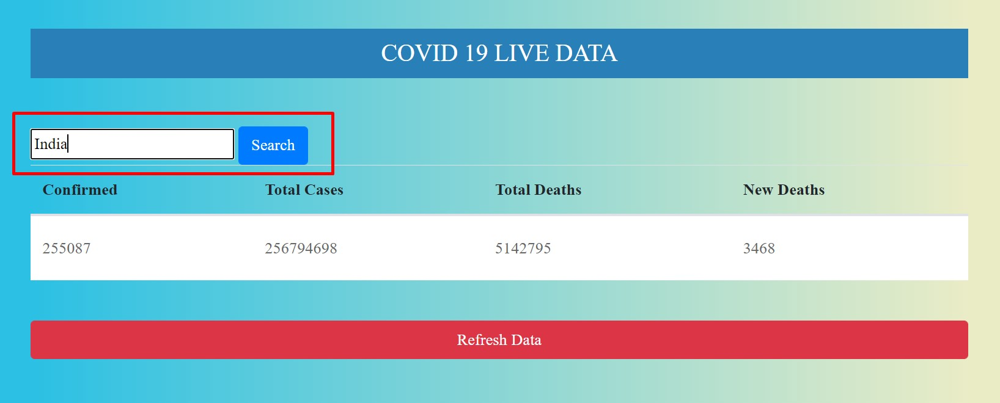
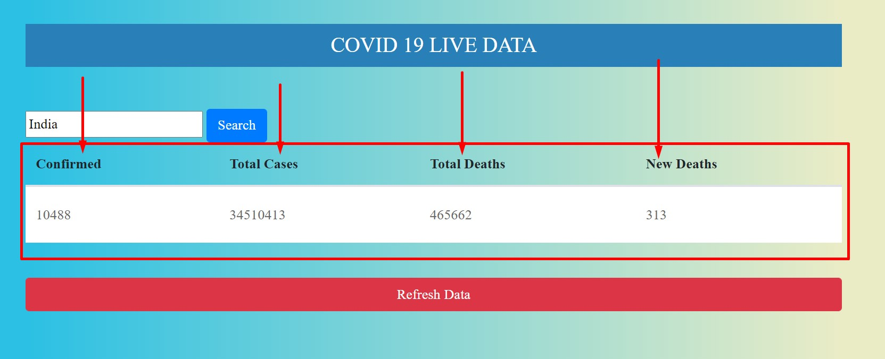

# Covid19Data
Overview:

A web page which fetches the real time data from Covid19 API and display the no.of cases,deaths etc.

LiveLink:

https://covid19data-9517e.web.app/

Input:

Output:

Novelty:

1. Build using HTML, CSS and JavaScript.
2. Easy to use.
3. User Friendly Interface.
